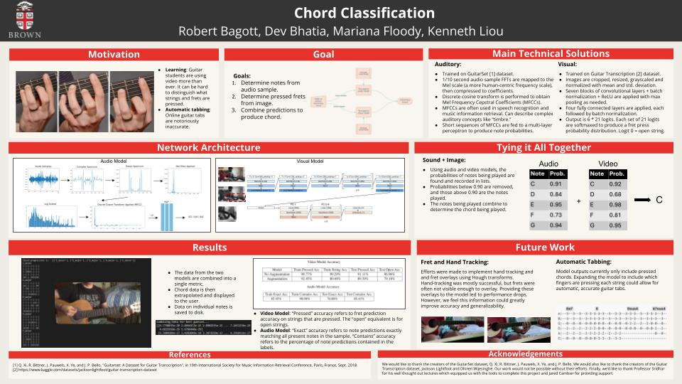

# chord-classification

This project will perform automated chord classification of an input mp4 video. Run test.py for usage.

[A link to our poster](https://docs.google.com/presentation/d/1HZPQgOR5GQlfl2drzJ2To3oG_ZDN-cRrB2GY5xduiR8/edit?usp=sharing)

